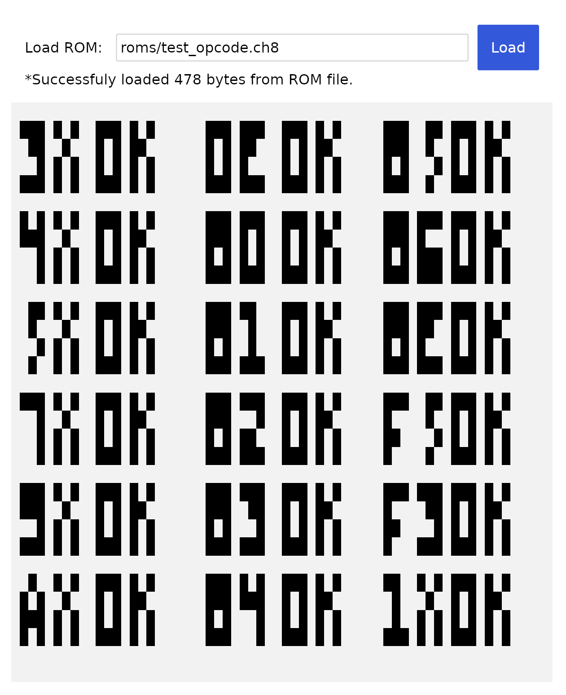

# CHIP-8 Emulator (Rust + Iced)

A desktop CHIP-8 emulator written in Rust with an [Iced](https://iced.rs/) interface. It provides a CHIP-8 CPU, keypad, timers, ROM loading, and a 64×32 monochrome display.



## Features

- **CHIP-8 core and display:** Executes CHIP-8 instructions on the original 64×32 monochrome display.
- **Timing:** The GUI requests an update every 16 ms and executes 10 CPU instructions per update, for nominal rates of about 60 timer updates and 600 instructions per second.
- **ROM loading:** Accepts a ROM file path through the GUI.
- **Keyboard mapping:** Maps a computer keyboard to the original 16-key hexadecimal keypad.

## Getting Started

### Prerequisites

- [Rust](https://www.rust-lang.org/tools/install) stable, including the rustfmt and Clippy components.
- A graphics driver supporting Vulkan or OpenGL.

### Fresh checkout

Clone the repository and install the required Rust components:

```bash
git clone https://github.com/alpine-algo/c8emu.git
cd c8emu
rustup component add rustfmt clippy
```

Run the same locked verification sequence used by continuous integration:

```bash
cargo fmt -- --check
cargo clippy --locked --all-targets --all-features -- -D warnings
cargo test --locked
cargo check --locked
```

Start the release build without changing the locked dependency graph:

```bash
cargo run --release --locked
```

Enter the path to a CHIP-8 ROM file and click **Load ROM**.

## Keypad Mapping

The CHIP-8 hexadecimal keypad is mapped to the keyboard as follows:

| CHIP-8 Keypad | Computer Keyboard |
| :---: | :---: |
| `1 2 3 C` | `1 2 3 4` |
| `4 5 6 D` | `Q W E R` |
| `7 8 9 E` | `A S D F` |
| `A 0 B F` | `Z X C V` |

## Compatibility Behavior

The emulator uses one fixed CHIP-8 quirk profile:

- `8xy1`, `8xy2`, and `8xy3` leave `VF` unchanged.
- `8xy6` and `8xyE` shift `Vx`; they do not use `Vy` as the source.
- `Bnnn` adds `V0` to `nnn`.
- Sprite drawing clips at the 64×32 display edges instead of wrapping.
- `Fx55` and `Fx65` increment `I` by the number of transferred registers.

ROMs that require a different quirk profile may behave differently.

## Troubleshooting

### Vulkan Validation Errors (Linux)

If `wgpu_hal::vulkan` reports validation errors on Linux, use the OpenGL backend:

```bash
WGPU_BACKEND=gl cargo run --release --locked
```

## References

- [Cowgod's CHIP-8 Technical Reference](http://devernay.free.fr/hacks/chip8/C8TECH10.HTM)
- [CHIP-8 Technical Reference (Matt Mikolay)](https://github.com/mattmikolay/chip-8/wiki/CHIP%E2%80%908-Technical-Reference)
- [CHIP-8 VM Specification (Toni Sagrista)](https://tonisagrista.com/blog/2021/chip8-spec/)

## License

This project is available under the [MIT License](LICENSE).
